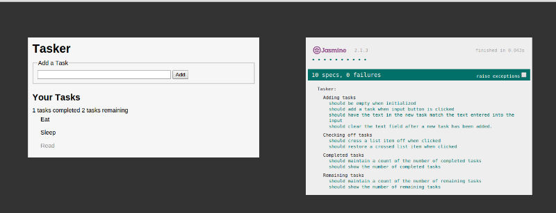

JSTasker
---------------------------------------

###About to-do lists
A todo list is a list of tasks that need to be accomplished before a due date. New tasks are added to the list when needed and completed tasks are crossed out. Tasks may be ordered based on priority.

Todo lists help people keep track of tasks without having to memorize them.

###Objectives
We are going to build a simple to-do list application that will be executed from the browser.

###Features
The to-do list application should enable users:
  + Add new tasks
  + Cross-out tasks that have been completed.
  + Maintain a count of tasks that have been completed.
  + Maintain a count of tasks that have yet to be completed

The to-do list appliction may possess additional features such as:
  + Persisting the tasks to the browser's local storage.

###Functionality
**Adding tasks**
  When the user clicks the 'Add' button after typing text into the input field, a new task is added to the task list and appears below the previous task.
**Checking tasks**
  When a task is clicked on, a line should be drawn across the text of the task (strikethrough). This indicates the task has been completed.
**Unchecking tasks**
  When a completed task is clicked, the strikethrough should be removed. This indicates the task has yet to be completed.
**Task count**
  Each time a new task is added, the 'remaining' task count should be updated. Each time a task is checked, the 'done' task count should be updated.

###Constraints
The to-do list application must meet the following constraints:
**Technical Constraints**
  + The application must be built with the jQuery Javascript library.
  + The application must utilize the OLP.

**Design Constraints**
  + The various sections and elements of the to-do list application should be referenced by properties of the application object. These attributes have been provided for you in the `jstasker.js` script file.

  **DO NOT change the ids of the elements or the names of the methods and attributes.**

###Sample output

